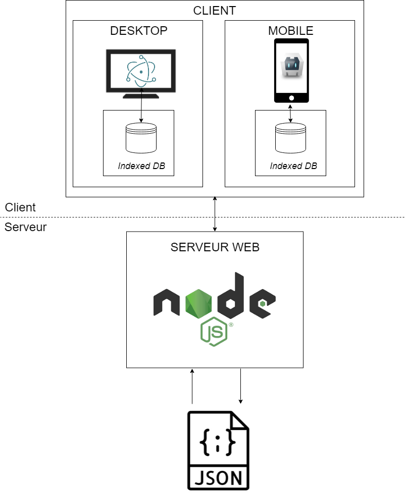
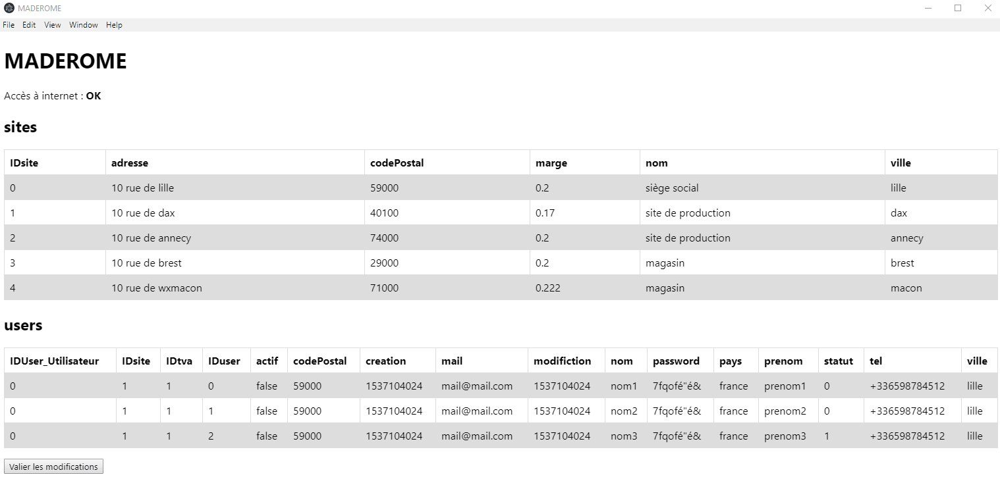
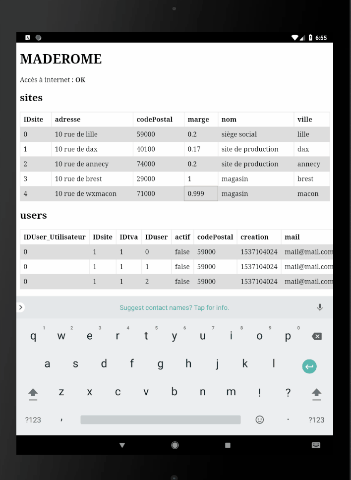
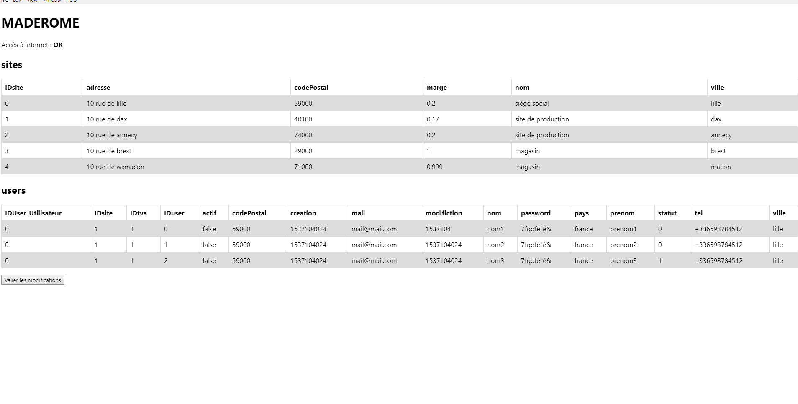
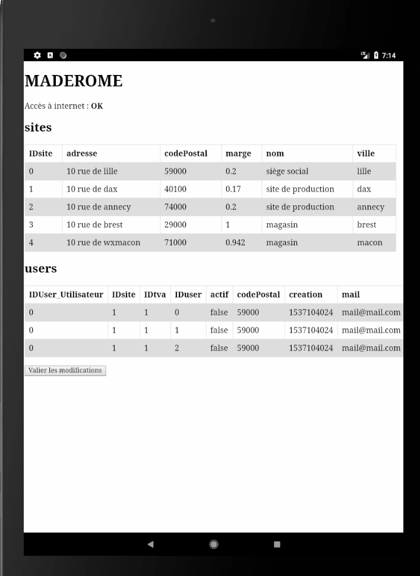
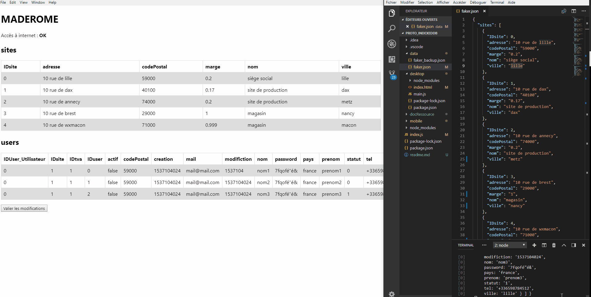
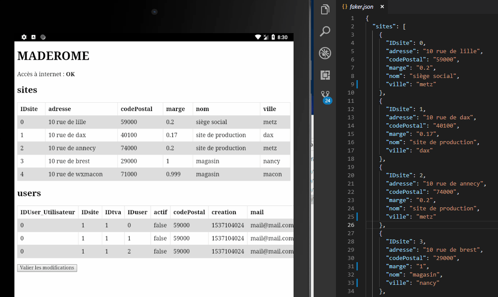

# Pototype : Synchronisation de données

## Sommaire
1. [Introduction](#Introduction)
2. [Outils](#Outils)
3. [Fonctionnement](#Fonctionnement)
4. [Jeu de test](#Jeu-de-test)
5. [Gestionnaire de paquets](#Gestionnaire-de-paquets)
6. [Serveur web](#Serveur-web)
7. [Visuel des applications](#Visuel-des-applications)
8. [Gestion du hors connexion](#Gestion-du-hors-connexion)
    * [Ecoute de la connexion](#Ecoute-de-la-connexion)
    * [Sauvegarde local](#Sauvegarde-local)
9. [Demonstration](#Demonstration)
10. [Mise en place du projet](#Mise-en-place-du-projet)

## Introduction
Suite à notre proposition technique où nous voulions implémenter un mode «hors ligne avec une synchronisation automatique », nous avons décidé de créer un prototype dans le but de nous rendre compte de l’impact réel de cette fonctionnalité sur le temps de développement.

## Outils
- Nous avons choisir d’utiliser deux technologies pour créer cette application :
  - Electron : Permet de créer une application client lourd multiplateforme.
  - Cordova : Permet de créer une application mobile.
Ces deux technologies utilisent le javascript, il est donc possible de créer des modules pouvant être utilisé dans les technologies (malgré un fonctionnement différent).
- Le serveur web sera en node.js avec le framework express qui va facilité la création de l’api REST commune au deux technologies (Application Cordova et Electron).
- Au niveau de la base de données, nous avons choisi d’utiliser :
  - LocalStorage pour stocker les données localement (et donc même quand il n’y a pas de connexion internet).
  - MariaDB pour stocker les données côté serveur (et donc quand une connexion internet est disponible) : Dans ce prototype, nous avons fait abstraction de la partie SQL et nous allons synchroniser un fichier JSON.

## Fonctionnement


## Jeu de test
Voici une partie du jeu de test au format json qui va nous servir de données de référence.

```json
{
  "sites": [
    {
      "IDsite": 0,
      "adresse": "10 rue de lille",
      "codePostal": "59000",
      "marge": "0.2",
      "nom": "siège social",
      "ville": "lille"
    },
    {
      "IDsite": 1,
      "adresse": "10 rue de dax",
      "codePostal": "40100",
      "marge": "0.17",
      "nom": "site de production",
      "ville": "dax"
    }
],…
```

## Gestionnaire de paquets
L’outil NPM permet de gérer les paquets node et va être utiliser pour créer un environnement de développement confortable par exemple la possibilité de crée un commande qui lance le serveur web et les application Electron et Cordova en même temps : Voici le contenus de notre package.json.

```json
{
  "name": "proto_indexeddb",
  "version": "1.0.0",
  "description": "",
  "main": "index.js",
  "scripts": {
    "test": "echo \"Error: no test specified\" && exit 1",
    "mobile": "cd ./mobile && cordova run android",
    "desktop": "cd ./desktop && electron .",
    "start": "concurrently \"node index.js\" \"npm run mobile\" \"npm run desktop\""
  },
  "author": "CelianB",
  "license": "ISC",
  "dependencies": {
    "body-parser": "^1.18.3",
    "concurrently": "^4.0.1",
    "cordova": "^8.0.0",
    "express": "^4.16.3"
  }
}
```

## Serveur web
```js
var express = require("express");
var bodyParser = require("body-parser"); // Middleware permettant de 'parser' le contenus des requetes
var app = express();                     // Création l'application
var fs = require("fs");                  // FileSystem : ecriture dans un fichier

var faker = require("./data/faker");     // ien vers le fichier json de données
app.use(bodyParser.urlencoded({ extended: true }));
app.use(bodyParser.json());

app.get("/", (req, res) => {
  //envoi les données (en allant sur la racine soit get sur http://localhost:3000/)
  res.send(faker);
});

app.post("/", (req, res) => {
  // Ecriture des données (en allant sur la racine soit post sur http://localhost:3000/)
  // Ecriture des données en BDD (ici fichier JSON)
  fs.writeFile(
    "./data/faker.json",JSON.stringify(req.body, null, 2), "utf-8", err => {
      if (err) {
        console.log(err);
      }
    }
  );
});
app.listen(3000); //Ecoute sur le port 3000
```

## Visuel des applications
Electron :


Cordova (sous Android) :



## Gestion du hors connexion
### Ecoute de la connexion
```js
  //Ecoute des evenements 'offline' et 'online'
  window.addEventListener('offline', () => setInternetStatus(false))
  window.addEventListener('online', () => {
    setInternetStatus(true);
    // On envoit les données dès que l'on retrouve une connexion internet.
    sendData();
  })

  function setInternetStatus(status) {
    isOnline = status;
    document.getElementById("internetStatus").innerHTML = status
      ? "OK"
      : "Hors Ligne";
  }
```
Electron :


Cordova (sous Android) :


### Sauvegarde local

```js
  function onValidateData() {
    // On sauvegarde les données localement (online ou offline)
    localStorage.setItem("data", htmlToData(document.getElementById("info")));
    //local save
    if (isOnline) {
      // Si on est en ligne on envoit directement les données
      sendData();
    }
  }

  // Envoi des données au serveur
  function sendData() {
  fetch("http://localhost:3000", {
    method: "post",
    // Envoi des données
    body: localStorage.getItem("data"),
    headers: {
      'Accept': 'application/json',
      'Content-Type': 'application/json'
    },
  })
}
```

## Demonstration
Demo Electron :


Demo Cordova (sous Android) :


## Mise en place du projet

Prérequis : 
  - Installer node.js : https://nodejs.org/ : npm sera installé avec node.js.
  - Avoir un SDK android supérieur à la version 7.0.0 : https://developer.android.com/studio/ (via les outils graphique d'Android Studio ou via les outils en ligne de commande).
  - Installer Electron : ``npm install electron -g``

Etapes :
1. Cloner ce repository : ``git clone https://github.com/CelianB/Proto_IndexedDB.git`` dans un dossier vide
2. Installer les dépendances : ``npm install`` à l'emplacement du fichier package.json.
3. La commande ``npm run strat`` va lancer le serveur nodeJs et l'appli cordova et Electron. Attention : Il faut bien configurer un emulateur Android avec le bon SDK (via AVD manager) ou un device android. Cordova va d'abord chercher à lancer l'application sur un Appareil (en USB : penssez à bien activer le debuggable par USB).
